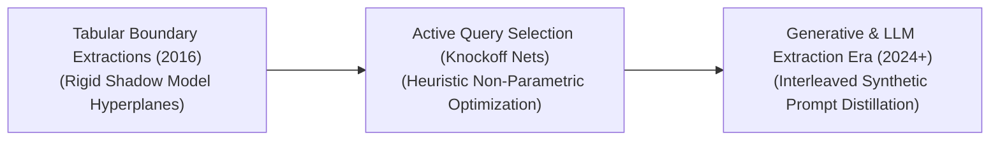
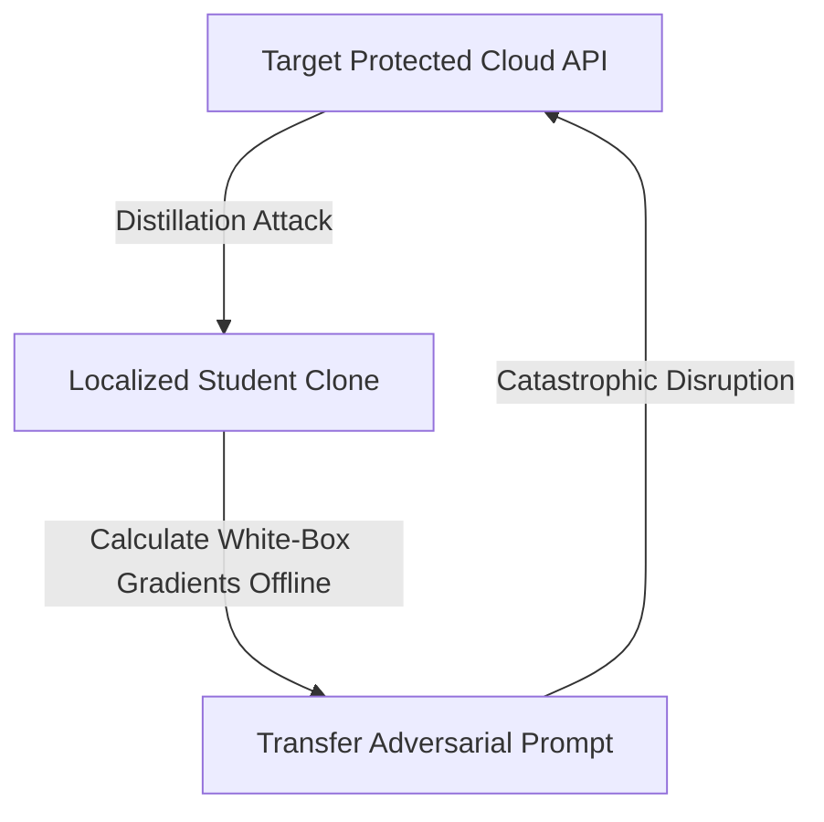

# Awesome-Distillation-Attacks
## Distillation Attacks in AI: Evolution, Variants, Types, & Applications

A Distillation Attack—historically intertwined with model extraction, black-box adversarial prompting, and membership inference—is an adversarial security framework designed to reverse-engineer, duplicate, or compromise the proprietary parameters of a protected target model (the Teacher). In knowledge distillation, a legitimate student model is trained on a teacher's soft output probabilities to optimize execution footprints [INDEX: 11]. A *Distillation Attack* exploits this exact mechanism maliciously. An adversary systematically prompts a black-box enterprise API, collects the output logits, and uses this retrieved data as a continuous labeling engine to train a replica clone (the Student). This architecture bypasses multi-million dollar model pre-training costs, violates corporate intellectual property (IP), and exposes the cloned network to downstream zero-shot offline adversarial exploits.

---

## 1. The Chronological Evolution

The technical methodology of cross-model parameter extraction has transitioned from basic tabular boundary queries to active dataset synthesis and native token-level latent tracking vectors.

*   **The Flat Equational Bound Era (Tramèr et al., 2016)**
    *   *Concept:* The structural baseline. Demonstrated that the decision boundaries of early machine learning models (like logistic regressions or shallow Multi-Layer Perceptrons) could be calculated exactly by solving systems of linear equations using a small number of systematically designed API queries.
    *   *Limitation:* Rigidly bounded to low-dimensional, linear spaces; completely incapable of extracting hidden parameters from deep, non-linear convolutional or transformer architectures.
*   **The Active Dataset Synthesis Era (Knoffoff Nets / Juuti et al., 2019)**
    *   *Concept:* Scaled extraction up to deep computer vision networks. Instead of random noise queries, frameworks like **Knockoff Nets** utilized unrelated, unannotated public image pools to query a protected target API. By capturing the output probability distributions (soft labels) generated by the teacher, the attacker trains a cloned student network to mirror the target model's precise perceptual classifications.
    *   *Significance:* Proved that an attacker does not need access to the target model's original private training data to copy its functional performance.
*   **The Generative & LLM Extraction Era (~2024–Present)**
    *   *Concept:* The modern state-of-the-art security threat vector. Exploits massive foundation architectures and conversational LLMs via automated **Self-Instruct pipelines** and **Logit Inversion**. Attackers use prompt expansion loops to force an advanced commercial API (like GPT-4o) to synthesize thousands of lines of pristine reasoning data, source code traces, and instruction pairs. This synthetic data is then used to train an open-weights student model (e.g., a compact 8B network), stealing the teacher's alignment data, capabilities, and system guardrails completely at a fraction of the cost.

---

## 2. Core Functional & Data-Extraction Variants

Distillation Attacks are strictly categorized based on the level of information the adversary can extract from the target model's output terminal boundaries.

### A. Soft-Label Distillation Attacks (Logit Extraction)
*   **Mechanism:** The adversary queries the target API and requests the full, un-truncated vector of output probabilities (logits) for all candidate classes. The attacker minimizes the Kullback-Leibler (KL) divergence between the teacher's soft targets and the student's output layer [INDEX: 11].
*   **Threat Profile:** Highly dangerous; soft logits contain "dark knowledge"—the target model's internal uncertainty boundaries and structural similarities across classes—allowing the clone model to converge with exceptionally high fidelity.

### B. Hard-Label Distillation Attacks (Decision-Boundary Extraction)
*   **Mechanism:** Deployed when a production API is hardened to return only the absolute final top-1 class name or token string, completely obscuring numerical logit parameters. The attacker applies iterative boundary-search algorithms (like HopSkipJump) or gradient-free optimization to probe the strict geometric switch points where one classification transforms into another.

### C. Data-Free Adversarial Distillation Attacks (Zero-Shot Extraction)
*   **Mechanism:** The attacker lacks access to any natural input data pool to query the API. To resolve this, they loop a Generative Adversarial Network (GAN) framework around the target API: a generative network synthesizes synthetic data vectors specifically engineered to maximize the teacher's output entropy, feeding those synthetic samples to the student clone dynamically.

---

## 3. Downstream Adversarial Vulnerability Types

Successfully executing a distillation attack provides the adversary with a localized, offline white-box replica of the hidden model, unlocking specialized cross-model security breaches.

*   **Adversarial Transferability Escalation**
    *   *The Loop:* Generating adversarial prompt attacks (like FGSM or PGD pixel modifications) against a closed, cloud-based black-box API is slow, expensive, and easily caught by security rate limits. A distillation attack bypasses this: the attacker builds a local student clone, calculates precise white-box gradients offline with zero detection risk, and transfers those malicious prompts straight back to the cloud API to disrupt it instantly.
*   **Watermark & Guardrail Evasion**
    *   *The Loop:* Enterprise providers inject hidden lexical watermarks or strict safety guardrails into their model outputs. Attackers use distillation routines to filter out these boundaries, fine-tuning the extracted student network to eliminate security restrictions while retaining core cognitive reasoning capabilities.

---

## 4. Corporate Countermeasures & Defense Infrastructure

Protecting proprietary model weights and training alignment data against distillation loops requires balancing API response resolution with automated traffic analysis.

*   **Logit Truncation and Temperature Satiation**
    *   *The Strategy:* Hardens the API endpoint output boundary. Serving infrastructures run **Top-k or Top-p truncation layers** to prune away long-tail logit values before data leaves the server. 
    *   *Mathematical Lock:* Forcing a strict **Low-Temperature Argmax** or converting outputs to hard labels removes the dark knowledge gradients required for high-fidelity student model convergence [INDEX: 11].
*   **Watermarking Model Outputs**
    *   *The Strategy:* Injecting subtle, statistical token-frequency biases (lexical watermarks) directly into the model's text generation stream. If an adversary attempts to distill a model using these outputs, the student network naturally inherits the watermark signature, serving as irrefutable cryptographic proof of data theft in court.
*   **Adaptive Query Auditing & Perturbation Layers**
    *   *The Strategy:* Security layers monitor inbound API user traffic patterns. If an account sends thousands of highly un-correlated, continuous, or synthetic queries (indicative of active extraction routing), the system deploys **Adaptive Noise Injection (such as PRADA filters)**, slightly distorting the output logits to corrupt the attacker's distillation gradients without impacting standard human user sessions.

---

## 5. Frontier Real-World AI Security Case Studies

*   **Commercial Language Model Alignment Theft**
    *   *The Scenario:* Open-source community initiatives or rival corporate entities query frontier commercial APIs (such as GPT-4o or Claude 3.5 Sonnet) via extensive multi-million token automation cycles. By extracting detailed multi-step reasoning traces and instruction pairs, they train compact 8B open-weights networks to mirror the advanced safety parameters, formatting syntax, and structural logic of the frontier model, entirely bypassing alignment R&D overheads.
*   **Autonomous Vehicle Computer Vision Cloned Exploits**
    *   *The Scenario:* Competitors or military adversaries record the active spatial object classification behavior of a leading self-driving vehicle's perception stack via camera-to-camera tracking inputs. They run distillation attacks to train a local imitation network, utilizing that clone white-box framework to calculate universal adversarial stickers (such as localized pixel tape patterns on stop signs) that cause the target vehicle to misclassify obstacles, triggering safety hazards.
*   **Proprietary Financial Valuation Model Extraction**
    *   *The Scenario:* Attacking corporate risk engines. A malicious entity queries a protected high-frequency asset-trading API using an automated grid of synthetic portfolio variables. The output scalar risk probabilities are parsed via a localized distillation network, effectively replicating the bank's multi-million dollar asset-valuation model offline to execute front-running market manipulation schemes.

---

## References
1. Hinton, G., Vinyals, O., & Dean, J. (2015). Distilling the knowledge in a neural network. *arXiv preprint arXiv:1503.02531* [INDEX: 11].
2. Tramèr, F., et al. (2016). Stealing machine learning models via prediction APIs. *Proceedings of the 25th USENIX Security Symposium*, 601-618.
3. Papernot, N., et al. (2017). Practical black-box attacks against machine learning. *Proceedings of the 2017 ACM on Asia Conference on Computer and Communications Security*, 506-519.
4. Juuti, M., et al. (2019). PRADA: Protecting against DNN model stealing attacks. *IEEE European Symposium on Security and Privacy (EuroS&P)*, 512-527.
5. Orekondy, T., Schiele, B., & Fritz, M. (2019). Knockoff nets: Stealing trained DNNs with top-k predictions. *Proceedings of the IEEE/CVF Conference on Computer Vision and Pattern Recognition (CVPR)*, 4922-4931.
6. Gudibande, A., et al. (2023). The false promise of imitating large language models. *arXiv preprint arXiv:2305.15717*.

---

To advance this documentation repository, threat-modeling architecture, or secure infrastructure workspace, consider exploring these adjacent development pathways:
* Build a **Python script using the Hugging Face and PyTorch APIs** illustrating how to apply an adaptive output logit perturbation layer to systematically degrade student model distillation accuracy during a mock extraction run.
* Generate a **comprehensive Markdown table** explicitly analyzing Soft-Label Stealing, Hard-Label Boundary Probing, Data-Free GAN Extraction, and Synthetic LLM Distillation across query complexity boundaries, VRAM/Token overhead costs, structural data dependency, and defense mitigation viability.
* Establish an **automated security monitoring pipeline using Triton** to profile how sharding API traffic across multi-node anomaly detection filters alters the processing latency of live concurrent user generation pre-fills.

***

**Proactive Repository Follow-Ups:**

To assist with your documentation repository setup, let me know how you would like to proceed by choosing one of the options below:
* I can provide a **complete Python code boilerplate using PyTorch** demonstrating how to calculate a boundary-probing extraction loss function against a simulated target logit output tensor.
* I can generate a **Markdown matrix table** explicitly comparing the vulnerability scores of the leading open-weight transformer architectures to downstream model extraction sprints.
* I can write a detailed technical explanation focusing on **how to implement a robust, automated cryptographic output watermark** to trace text data back to your production server nodes.

