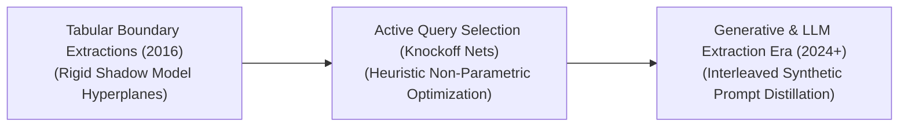
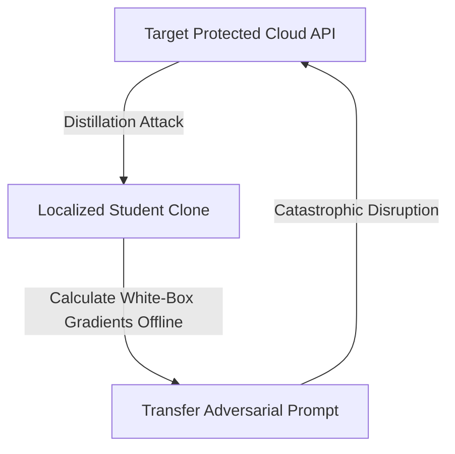

# Awesome-Distillation-Attacks
## Distillation Attacks in AI: Evolution, Variants, Types, & Applications

A Distillation Attack—historically intertwined with model extraction, black-box adversarial prompting, and membership inference—is an adversarial security framework designed to reverse-engineer, duplicate, or compromise the proprietary parameters of a protected target model (the Teacher). In knowledge distillation, a legitimate student model is trained on a teacher's soft output probabilities to optimize execution footprints [INDEX: 11]. A *Distillation Attack* exploits this exact mechanism maliciously. An adversary systematically prompts a black-box enterprise API, collects the output logits, and uses this retrieved data as a continuous labeling engine to train a replica clone (the Student). This architecture bypasses multi-million dollar model pre-training costs, violates corporate intellectual property (IP), and exposes the cloned network to downstream zero-shot offline adversarial exploits.

---

## 1. The Chronological Evolution

The technical methodology of cross-model parameter extraction has transitioned from basic tabular boundary queries to active dataset synthesis and native token-level latent tracking vectors.

| Era / Concept | Technical Details & Limitations / Significance | Year | First Used Paper Link |
| :--- | :--- | :--- | :--- |
| **The Flat Equational Bound Era** (Tramèr et al., 2016) | **Concept:** The structural baseline. Demonstrated that the decision boundaries of early machine learning models (like logistic regressions or shallow MLPs) could be calculated exactly by solving systems of linear equations using systematically designed API queries. **Limitation:** Rigidly bounded to low-dimensional, linear spaces; incapable of extracting hidden parameters from deep convolutional or transformer architectures. | 2016 | [Stealing Machine Learning Models via Prediction APIs](https://arxiv.org/abs/1609.02943) |
| **The Active Dataset Synthesis Era** (Knockoff Nets / Juuti et al., 2019) | **Concept:** Scaled extraction up to deep computer vision networks. Frameworks like **Knockoff Nets** query a target API using unrelated, unannotated public images to capture soft labels, training a student to mirror classification behavior. **Significance:** Proved that an attacker does not need original private training data to copy target performance. | 2019 | [Knockoff Nets: Stealing Trained DNNs with Top-k Predictions](https://arxiv.org/abs/1812.02766) / [PRADA: Protecting against DNN Model Stealing Attacks](https://arxiv.org/abs/1805.02628) |
| **The Generative & LLM Extraction Era** (~2024–Present) | **Concept:** Modern threat vector exploiting foundation models/LLMs via **Self-Instruct pipelines** and **Logit Inversion**. Uses prompt loops to force APIs to synthesize reasoning/capability data, training compact clones at a fraction of the cost, stealing capabilities/guardrails. | 2023 | [The False Promise of Imitating Large Language Models](https://arxiv.org/abs/2305.15717) / [Self-Instruct: Aligning Language Models with Self-Generated Instructions](https://arxiv.org/abs/2212.10560) |

---

## 2. Core Functional & Data-Extraction Variants

Distillation Attacks are strictly categorized based on the level of information the adversary can extract from the target model's output terminal boundaries.

| Variant | Mechanism & Threat Profile | Year | First Used Paper Link |
| :--- | :--- | :--- | :--- |
| **A. Soft-Label Distillation Attacks (Logit Extraction)** | **Mechanism:** Attacker queries full un-truncated logits and minimizes KL divergence between teacher and student [INDEX: 11]. **Threat Profile:** Highly dangerous; soft logits contain "dark knowledge" (uncertainty/similarities) allowing high-fidelity clone convergence. | 2015 | [Distilling the Knowledge in a Neural Network](https://arxiv.org/abs/1503.02531) |
| **B. Hard-Label Distillation Attacks (Decision-Boundary Extraction)** | **Mechanism:** Deployed when API returns only top-1 hard labels. Attacker uses boundary-search (e.g., HopSkipJump) or gradient-free optimization to probe boundary switch points. | 2017 | [Practical Black-Box Attacks against Machine Learning](https://arxiv.org/abs/1602.02697) / [HopSkipJumpAttack: A Query-Efficient Decision-Based Attack](https://arxiv.org/abs/1904.02144) |
| **C. Data-Free Adversarial Distillation Attacks (Zero-Shot Extraction)** | **Mechanism:** Lacking natural data, attackers loop a GAN around the API. The generator synthesizes samples to maximize target model entropy, feeding samples to the student. | 2019 | [Zero-Shot Knowledge Transfer via Adversarial Belief Matching](https://arxiv.org/abs/1906.02243) / [Data-Free Adversarial Distillation](https://arxiv.org/abs/1912.11006) |

---

## 3. Downstream Adversarial Vulnerability Types

Successfully executing a distillation attack provides the adversary with a localized, offline white-box replica of the hidden model, unlocking specialized cross-model security breaches.

| Vulnerability Type | Description / Attack Loop | Year | First Used Paper Link |
| :--- | :--- | :--- | :--- |
| **Adversarial Transferability Escalation** | **The Loop:** Bypasses black-box query limits by building a local student clone, calculating white-box gradients offline, and transferring generated adversarial prompts (FGSM/PGD) back to disrupt the cloud API. | 2017 | [Practical Black-Box Attacks against Machine Learning](https://arxiv.org/abs/1602.02697) |
| **Watermark & Guardrail Evasion** | **The Loop:** Filters out hidden lexical watermarks/safety guardrails by using distillation to fine-tune the student clone, removing security constraints while keeping cognitive reasoning. | 2019 | [Effectiveness of Distillation Attack and Countermeasure on Neural Network Watermarking](https://arxiv.org/abs/1906.01254) |

---

## 4. Corporate Countermeasures & Defense Infrastructure

Protecting proprietary model weights and training alignment data against distillation loops requires balancing API response resolution with automated traffic analysis.

| Countermeasure | Defense Strategy & Technical Mechanism | Year | First Used Paper Link |
| :--- | :--- | :--- | :--- |
| **Logit Truncation and Temperature Satiation** | **Strategy:** Hardens API boundaries using Top-k/p truncation. **Mechanism:** Forcing a Low-Temperature Argmax or hard labels removes dark knowledge gradients necessary for high-fidelity student convergence [INDEX: 11]. | 2016 | [Stealing Machine Learning Models via Prediction APIs](https://arxiv.org/abs/1609.02943) / [Defending Against Neural Network Model Stealing Attacks Using Deceptive Perturbations](https://arxiv.org/abs/1906.00267) |
| **Watermarking Model Outputs** | **Strategy:** Injects subtle, statistical token-frequency biases (lexical watermarks) into the text generation stream. Distilled students inherit this watermark, proving data theft. | 2023 | [A Watermark for Large Language Models](https://arxiv.org/abs/2301.10226) |
| **Adaptive Query Auditing & Perturbation Layers** | **Strategy:** Monitors traffic patterns. Deploys Adaptive Noise Injection (PRADA filters) if suspicious synthetic query sequences are detected, disrupting distillation gradients without affecting benign sessions. | 2019 | [PRADA: Protecting against DNN Model Stealing Attacks](https://arxiv.org/abs/1805.02628) |

---

## 5. Frontier Real-World AI Security Case Studies

| Case Study | Attack Scenario | Year | First Used Paper Link |
| :--- | :--- | :--- | :--- |
| **Commercial Language Model Alignment Theft** | **Scenario:** Competitors query frontier APIs (e.g. GPT-4o) to extract reasoning traces and instruction pairs, training compact open-weights models to mirror safety parameters and structure while bypassing alignment R&D costs. | 2023 | [The False Promise of Imitating Large Language Models](https://arxiv.org/abs/2305.15717) |
| **Autonomous Vehicle Computer Vision Cloned Exploits** | **Scenario:** Competitors record classification behavior of a self-driving perception stack to distill a local model. They use its white-box gradients to create physical adversarial stickers causing misclassification. | 2021 | [Play the Imitation Game: Model Extraction Attack against Autonomous Driving Localization](https://www.usenix.org/conference/usenixsecurity21/presentation/shen-yelong) / [Model Extraction Attack against Object Detectors](https://arxiv.org/abs/2104.09342) |
| **Proprietary Financial Valuation Model Extraction** | **Scenario:** Adversary queries high-frequency trading API using synthetic portfolio variables to distill a replica model offline, enabling market manipulation. | 2020 | [Exploiting Explanations for Model Extraction via Knowledge Distillation](https://arxiv.org/abs/2010.04029) / [Stealing Machine Learning Models via Prediction APIs](https://arxiv.org/abs/1609.02943) |

---

## References
1. Hinton, G., Vinyals, O., & Dean, J. (2015). Distilling the knowledge in a neural network. *arXiv preprint arXiv:1503.02531* [INDEX: 11].
2. Tramèr, F., et al. (2016). Stealing machine learning models via prediction APIs. *Proceedings of the 25th USENIX Security Symposium*, 601-618.
3. Papernot, N., et al. (2017). Practical black-box attacks against machine learning. *Proceedings of the 2017 ACM on Asia Conference on Computer and Communications Security*, 506-519.
4. Juuti, M., et al. (2019). PRADA: Protecting against DNN model stealing attacks. *IEEE European Symposium on Security and Privacy (EuroS&P)*, 512-527.
5. Orekondy, T., Schiele, B., & Fritz, M. (2019). Knockoff nets: Stealing trained DNNs with top-k predictions. *Proceedings of the IEEE/CVF Conference on Computer Vision and Pattern Recognition (CVPR)*, 4922-4931.
6. Gudibande, A., et al. (2023). The false promise of imitating large language models. *arXiv preprint arXiv:2305.15717*.

---

To advance this documentation repository, threat-modeling architecture, or secure infrastructure workspace, consider exploring these adjacent development pathways:
* Build a **Python script using the Hugging Face and PyTorch APIs** illustrating how to apply an adaptive output logit perturbation layer to systematically degrade student model distillation accuracy during a mock extraction run.
* Generate a **comprehensive Markdown table** explicitly analyzing Soft-Label Stealing, Hard-Label Boundary Probing, Data-Free GAN Extraction, and Synthetic LLM Distillation across query complexity boundaries, VRAM/Token overhead costs, structural data dependency, and defense mitigation viability.
* Establish an **automated security monitoring pipeline using Triton** to profile how sharding API traffic across multi-node anomaly detection filters alters the processing latency of live concurrent user generation pre-fills.

***

**Proactive Repository Follow-Ups:**

To assist with your documentation repository setup, let me know how you would like to proceed by choosing one of the options below:
* I can provide a **complete Python code boilerplate using PyTorch** demonstrating how to calculate a boundary-probing extraction loss function against a simulated target logit output tensor.
* I can generate a **Markdown matrix table** explicitly comparing the vulnerability scores of the leading open-weight transformer architectures to downstream model extraction sprints.
* I can write a detailed technical explanation focusing on **how to implement a robust, automated cryptographic output watermark** to trace text data back to your production server nodes.

