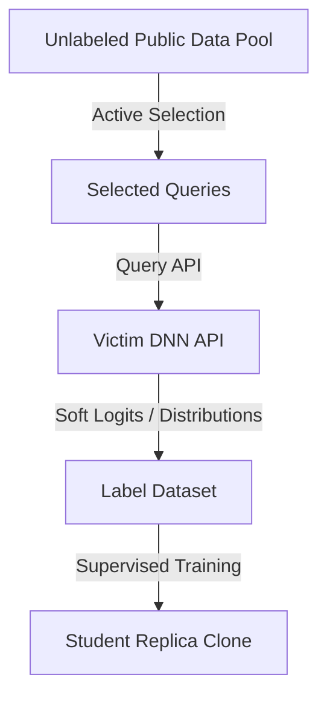

# The Active Dataset Synthesis Era

## Overview
As model architectures grew to deep neural networks (CNNs/RNNs), direct equation solving became impossible due to non-linearities and hidden layers. The Active Dataset Synthesis Era shifted the goal from exact weight recovery to functional replication. Adversaries use an active dataset selection process (like in Knockoff Nets), where they query a victim model API using a large, unlabeled transfer dataset (which doesn't even need to be from the target distribution). The soft probability outputs returned by the victim model are captured and used as labels to train a student replica model.

## Attack Architecture & Flow

---
[← Back to README](../README.md)
