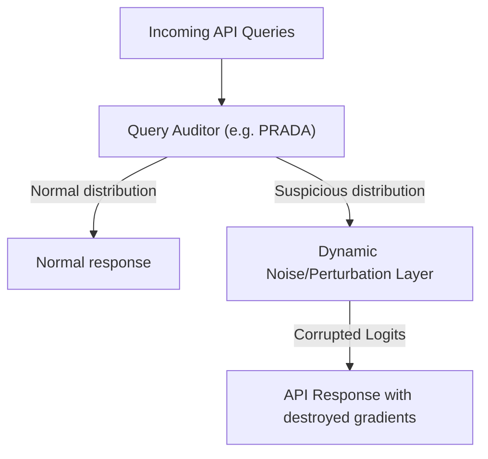

# Adaptive Query Auditing & Perturbation Layers

## Overview
This defense mechanism monitors incoming query traffic to identify and block model extraction attempts. Systems like PRADA track the distribution and relationship of incoming queries over time. If a user or IP range is flagged for sending highly un-correlated, programmatic, or synthetic queries (indicative of distillation attacks), the defense layer dynamically injects noise or slightly perturbs the output logits to destroy the gradient information required by the attacker.

## Attack Architecture & Flow

---
[← Back to README](../README.md)
