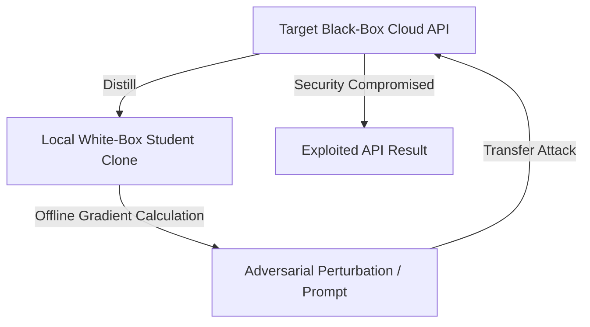

# Adversarial Transferability Escalation

## Overview
Adversarial prompts and inputs generated against white-box models have a high likelihood of transferring to black-box models. However, querying a black-box cloud API directly to find adversarial examples is slow, expensive, and easily detected by rate limiters. In this attack, the adversary uses distillation to create a local, white-box student replica. The adversary then calculates gradients and generates adversarial perturbations offline on the clone, which are then successfully transferred to exploit the target cloud API.

## Attack Architecture & Flow

---
[← Back to README](../README.md)
