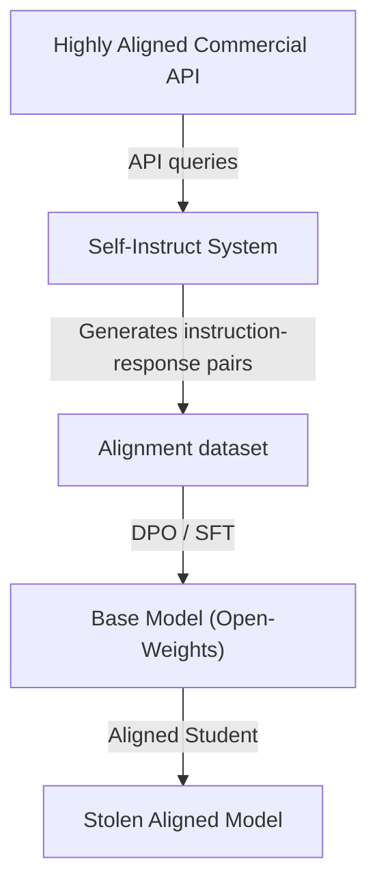

# Commercial Language Model Alignment Theft

## Overview
Commercial LLM providers spend millions of dollars on Reinforcement Learning from Human Feedback (RLHF), Direct Preference Optimization (DPO), and red-teaming to align models for safety, helpfulness, and style. Competitors and researchers can execute alignment theft by querying a highly aligned teacher API (like GPT-4o) using automated prompt expansion routines. The synthetic data generated is then used to fine-tune a smaller base model, bypassing the massive research and development overhead of human alignment.

## Attack Architecture & Flow

---
[← Back to README](../README.md)
