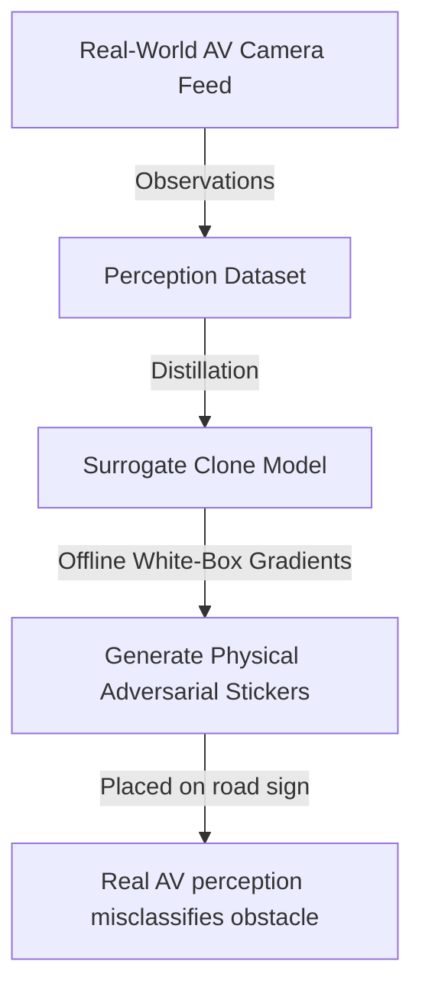

# Autonomous Vehicle Computer Vision Cloned Exploits

## Overview
Autonomous vehicles rely on complex object detection and localization perception stacks. In a cloned exploit scenario, a competitor or adversary captures the spatial classification behavior of an AV stack (e.g. camera feeds and corresponding detections). They run distillation attacks to train a local student replica. Since the adversary now has a local white-box copy of the vehicle's perception stack, they can execute offline gradient calculations to synthesize physical adversarial triggers (such as custom stickers on stop signs) designed to cause catastrophic misclassification by the real vehicle.

## Attack Architecture & Flow

---
[← Back to README](../README.md)
