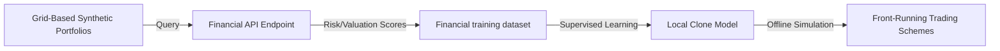

# Proprietary Financial Valuation Model Extraction

## Overview
Financial institutions use proprietary machine learning models for high-frequency asset trading, credit risk scoring, and valuation forecasting. Because these models are served via black-box APIs, they are vulnerable to grid-based querying extraction. Attackers issue a systematic grid of synthetic inputs representing different portfolio profiles and risk options. The outputs are gathered to train a local regression clone, allowing the attacker to run front-running trading strategies and market manipulation offline.

## Attack Architecture & Flow

---
[← Back to README](../README.md)
