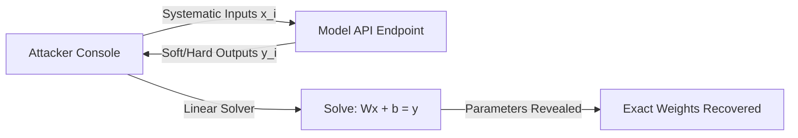

# The Flat Equational Bound Era

## Overview
The structural baseline of model extraction attacks. Early machine learning models, such as linear regressions, logistic regressions, or shallow Multi-Layer Perceptrons, have decision boundaries that can be modeled mathematically. By querying the model API with specifically selected input data points, an attacker can construct a system of linear equations representing the boundary hyperplanes. Solving these equations yields the exact weight parameters of the victim model.

## Attack Architecture & Flow

---
[← Back to README](../README.md)
