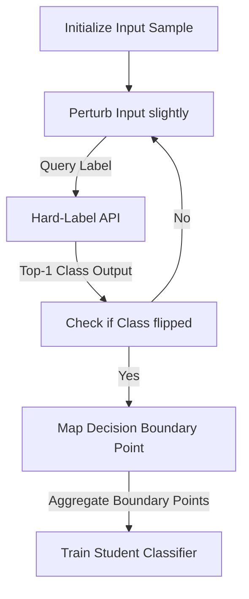

# Hard-Label Distillation Attacks

## Overview
When production APIs are secured to return only the final top-1 class prediction or token string (completely hiding numerical logits), attackers must use decision-boundary probing. Using iterative, gradient-free optimization or boundary exploration algorithms (e.g., HopSkipJump), the attacker searches for the geometric transition boundaries in the input space where the class label flips. This boundary information is then used to construct training data to clone the decision frontier.

## Attack Architecture & Flow

---
[← Back to README](../README.md)
