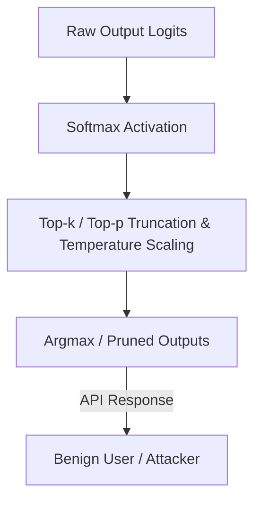

# Logit Truncation & Temperature Satiation

## Overview
A primary countermeasure to protect model APIs from soft-label distillation. The model serving infrastructure removes the detailed probability distributions (logits) of non-top classes. By applying top-k or top-p filtering, or forcing a low-temperature argmax, the server outputs only the top options or hard labels. This truncates the information ('dark knowledge') available to the attacker, significantly raising the query complexity of any extraction attempt.

## Attack Architecture & Flow

---
[← Back to README](../README.md)
