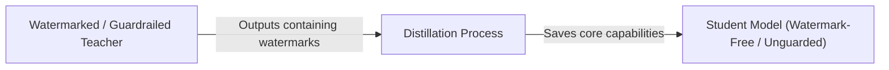

# Watermark & Guardrail Evasion via Distillation

## Overview
Enterprise AI providers protect their models' outputs using watermarks (statistical token-frequency patterns) or safety alignment guardrails. Because these defenses are often independent of the core task capabilities, an attacker can use distillation to filter them out. By training a student clone on the output of the watermarked teacher, the student learns only the core task distribution (which is highly structured) while ignoring the lower-importance watermark biases and safety guardrails, resulting in an unconstrained, watermark-free model.

## Attack Architecture & Flow

---
[← Back to README](../README.md)
