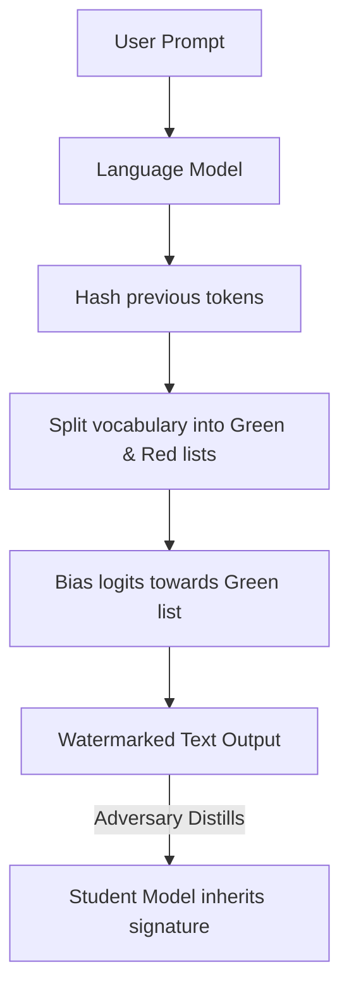

# Watermarking Model Outputs

## Overview
Watermarking text and media generation models involves embedding a subtle, statistical signature directly into the generated outputs. For LLMs, this is typically done by partition-based token bias scaling (such as Green/Red list token division), where a pseudo-random key biases the model to select specific tokens. If an attacker distills the model, the student network naturally fits the watermark distribution, leaving a cryptographic fingerprint that provides legal proof of data theft.

## Attack Architecture & Flow

---
[← Back to README](../README.md)
